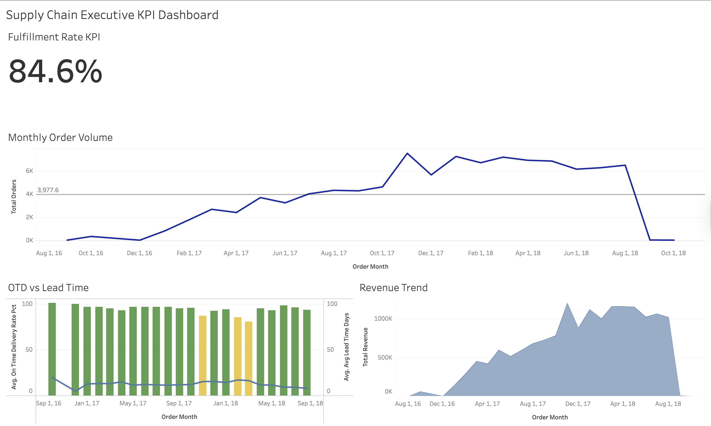
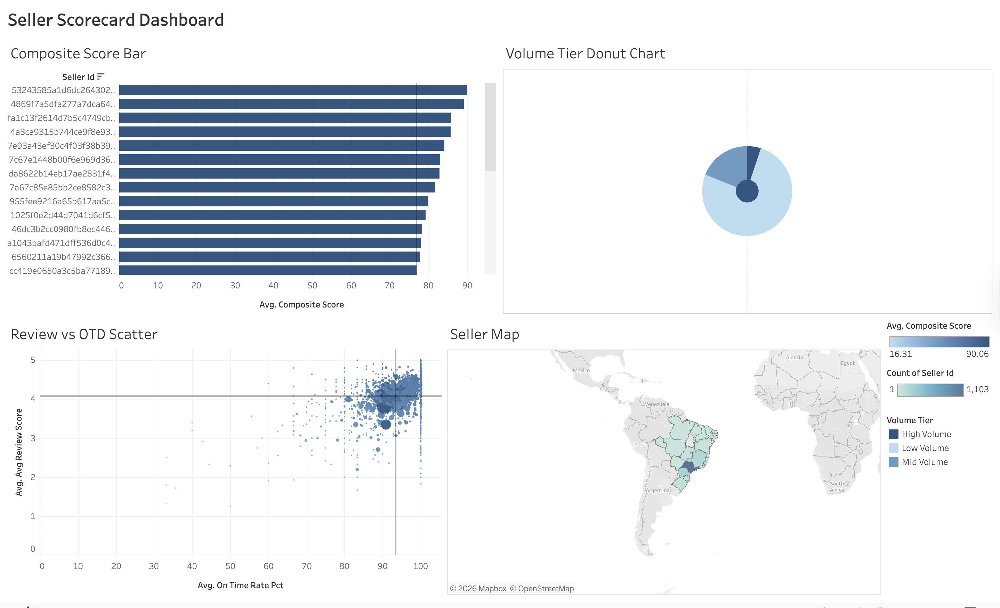
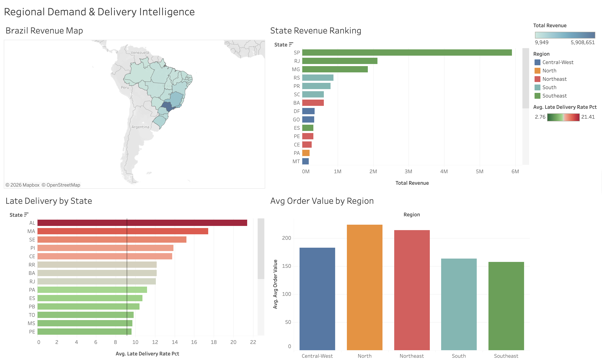
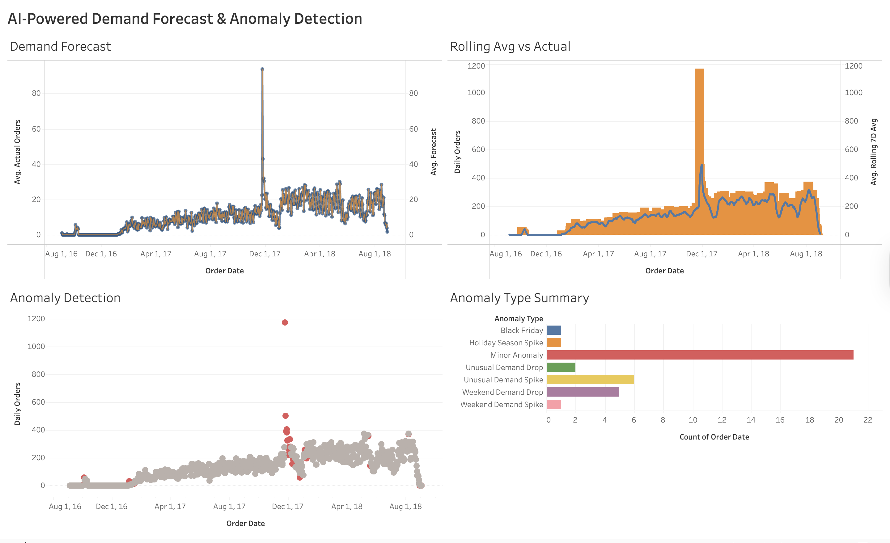

# Retail Supply Chain & Demand Intelligence

**End-to-end supply chain analytics project using PostgreSQL, Python, and Tableau Public.**

Dataset: [Olist Brazilian E-Commerce](https://www.kaggle.com/datasets/olistbr/brazilian-ecommerce), 100,000+ real orders across 9 relational tables

---

## Why I Built This

I wanted to go beyond the SQL and Tableau work I did at Fannie Mae and build something end-to-end on my own. Supply chain analytics caught my attention because it's data-heavy and touches every part of a business, from vendors to customers to regional demand.

I used the Olist Brazilian E-Commerce dataset because it's a real production dataset with 9 relational tables, which forced me to think about joins, data quality, and schema design rather than working with a clean pre-built CSV.

The AI forecasting piece (Prophet + Isolation Forest) was a stretch goal. I wanted to see how ML outputs could be integrated directly into a BI dashboard rather than staying in a notebook.

---

## Project Overview

| Dashboard | Business Question | Key Metrics |
|---|---|---|
| Executive KPI | How is the supply chain performing overall? | Fulfillment rate, on-time delivery %, lead time, revenue |
| Seller Scorecard | Which vendors are reliable vs. at-risk? | Composite performance score, review score, delivery rate |
| Regional Demand | Where is demand concentrated and growing? | Revenue by state, demand-supply gap, avg order value |
| AI Demand Forecast | What does demand look like for the next 90 days? | Prophet forecast, anomaly flags, confidence intervals |

---

## Dashboards

### Dashboard 1: Executive KPI Overview


### Dashboard 2: Seller Performance Scorecard


### Dashboard 3: Regional Demand Map


### Dashboard 4: AI-Powered Demand Forecast


---

## Tech Stack

| Layer | Tools |
|---|---|
| Database | PostgreSQL 15+ |
| Data Ingestion | Python, Pandas, SQLAlchemy |
| AI Forecasting | Facebook Prophet |
| Anomaly Detection | Scikit-learn Isolation Forest |
| Visualization | Tableau Public |

---

## Project Structure

```
supply-chain-analytics/
├── data/
│   ├── (place Olist CSVs here after Kaggle download)
│   └── tableau_exports/     ← generated by Python pipeline
│
├── sql/
│   ├── 00_schema_and_load.sql      # Database schema + COPY commands
│   ├── 01_data_quality.sql         # Null checks, duplicates, outliers
│   ├── 02_order_fulfillment.sql    # On-time rate, lead time, funnel
│   ├── 03_seller_scorecard.sql     # Composite vendor performance score
│   ├── 04_delivery_analysis.sql    # Delay root cause by state/category
│   ├── 05_regional_demand.sql      # Revenue + demand by Brazilian state
│   ├── 06_category_performance.sql # Product category KPIs
│   └── 07_tableau_views.sql        # Materialized views for export
│
├── python/
│   ├── requirements.txt
│   ├── 01_load_to_postgres.py      # Ingest 9 CSVs into PostgreSQL
│   ├── 02_demand_forecast.py       # Prophet 90-day demand forecast
│   ├── 03_anomaly_detection.py     # Isolation Forest anomaly detection
│   └── 04_export_for_tableau.py    # Export all data to CSVs for Tableau
│
└── tableau/
    └── DASHBOARD_BUILD_GUIDE.md    # Step-by-step Tableau build instructions
```

---

## Setup Instructions

### Step 1: Get the Data

1. Create a free Kaggle account at [kaggle.com](https://kaggle.com)
2. Download the dataset: [Olist Brazilian E-Commerce](https://www.kaggle.com/datasets/olistbr/brazilian-ecommerce)
3. Unzip and place all 9 CSV files in the `data/` directory

### Step 2: Set Up PostgreSQL

```bash
createdb supply_chain
cd python
pip install -r requirements.txt
```

Create a `.env` file in the `python/` directory:

```
DB_HOST=localhost
DB_PORT=5432
DB_NAME=supply_chain
DB_USER=your_postgres_username
DB_PASSWORD=your_postgres_password
```

### Step 3: Load Data into PostgreSQL

```bash
cd python
python 01_load_to_postgres.py
```

### Step 4: Run SQL Analysis

```bash
psql -U your_user -d supply_chain -f sql/00_schema_and_load.sql
psql -U your_user -d supply_chain -f sql/01_data_quality.sql
psql -U your_user -d supply_chain -f sql/07_tableau_views.sql
```

### Step 5: Run AI/ML Models

```bash
cd python
python 02_demand_forecast.py
python 03_anomaly_detection.py
python 04_export_for_tableau.py
```

This creates 6 CSV files in `data/tableau_exports/`: exec_kpis.csv, seller_scorecard.csv, regional_demand.csv, category_daily.csv, forecast_output.csv, anomaly_flags.csv

### Step 6: Build Tableau Dashboards

See [`tableau/DASHBOARD_BUILD_GUIDE.md`](tableau/DASHBOARD_BUILD_GUIDE.md) for the full guide.

---

## Key Analytical Techniques

### Composite Seller Scoring
Vendors are scored using a weighted model: 40% on-time delivery rate, 30% average customer review score (normalized 0-100), 30% revenue rank (normalized 0-100). This gives each seller a single comparable score.

### Demand Forecasting with Prophet
Facebook Prophet handles weekly seasonality (weekday vs. weekend patterns), yearly seasonality (holiday peaks), Brazilian national holidays, and multiplicative seasonality for e-commerce volume growth.

### Anomaly Detection with Isolation Forest
Features used: raw daily order volume, 7-day and 30-day rolling averages, lag features (yesterday, last week same day), day-of-week encoding, and deviation from rolling average. Flagged anomalies are labeled (Black Friday, Carnaval, etc.) and visualized in Tableau.

---

## SQL Highlights

- Window functions: `RANK()`, `LAG()`, `SUM() OVER()`, `MIN() OVER()`
- CTEs: multi-step analytical logic broken into readable named steps
- Conditional aggregation: `COUNT(*) FILTER (WHERE ...)` for pivot-style metrics
- Date arithmetic: `EXTRACT(EPOCH FROM ...)` for lead time calculations
- Materialized views: pre-aggregated views optimized for Tableau

---

## Results

| Metric | Value |
|---|---|
| Total Orders Analyzed | ~99,000 |
| On-Time Delivery Rate | ~92% |
| Avg Lead Time | ~12 days |
| Top Revenue State | São Paulo (SP) |
| Sellers Scored | ~3,000+ |
| Forecast Horizon | 90 days |
| Anomalies Detected | ~5% of days |

---

## Data Source

**Brazilian E-Commerce Public Dataset by Olist**
- Source: [Kaggle](https://www.kaggle.com/datasets/olistbr/brazilian-ecommerce)
- License: CC BY-NC-SA 4.0
- Size: ~9 tables, 100,000+ orders, 2016-2018
